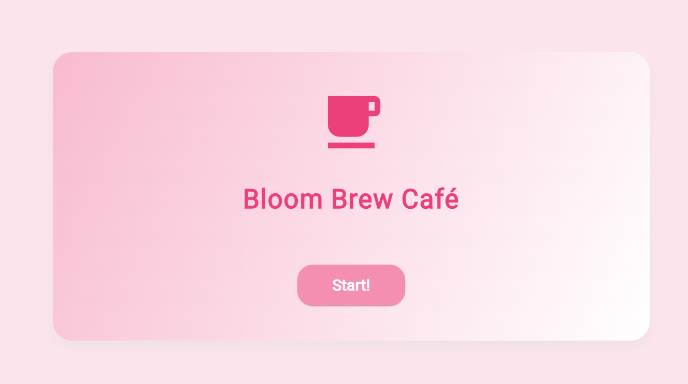
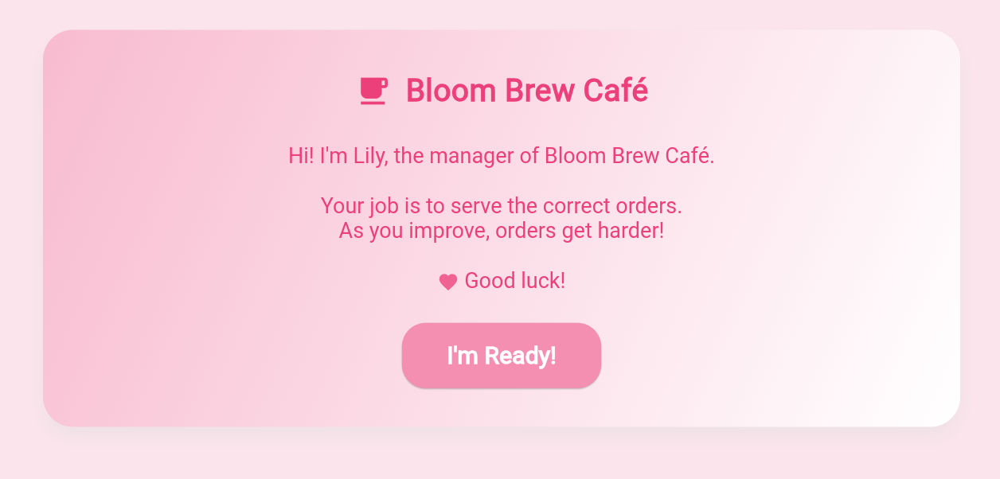
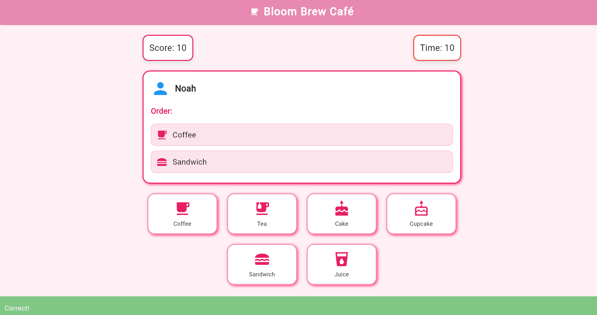
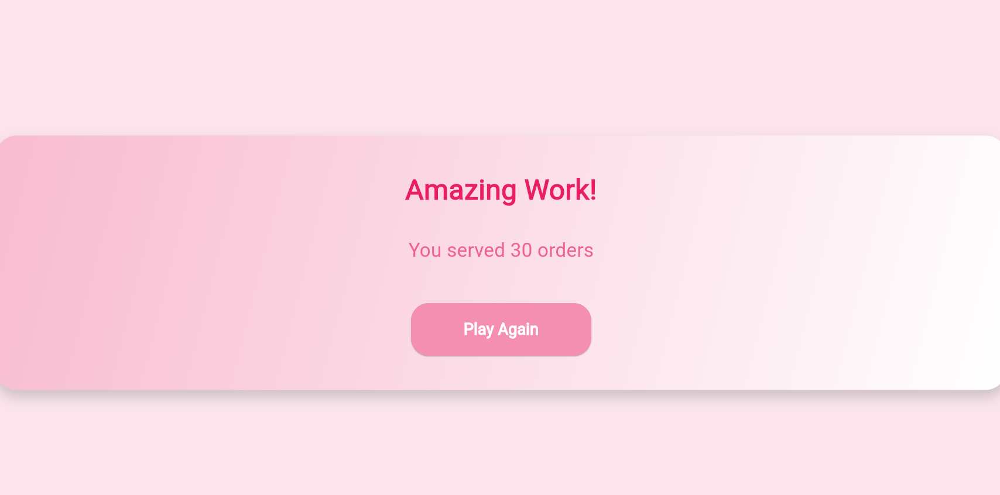

# cafe_game

An interactive café game with a cozy cafe vibe built in Flutter (Dart) with native Android functionality using Kotlin/Java

The app is a game where the user will Serve customers and complete orders under a time limit.

# Getting Started

# Clone the repo:

- git clone your  

# Navigate to the project folder:

- cd cafe_game

# Install dependencies:

- flutter pub get

# Run the app:

- flutter run

# Built With
- Flutter
- Dart

# Features
- Dynamic customer orders with increasing difficulty
- Countdown timer for each order
- Interactive MenuButton and OrderCard - widgets
- Simple Animated UI and responsive design
- Modular and reusable code structure

# main.dart
- Entry point of the app.
- Initializes the CafeGameApp and sets the start screen.

# models/order.dart
- Defines the Order model.
- Stores the name of a menu item and overrides toString() for easy display.

# utils/constants.dart
- Stores constant data:
- menu: list of menu items with names and icons
- customers: list of customer names, icons, and colors

# widgets/menu_button.dart
- Custom widget for menu buttons.
- Handles tap, hover, and selected states with animation.

# widgets/order_card.dart
- Displays a customer’s order in a card.
- Shows which items are selected correctly or incorrectly.
- Handles multiple quantities of the same item.

# views/start_view.dart
- The first screen the user sees.
- Shows the café title and a start button to go to the intro.

# views/intro_view.dart
- Provides instructions for the game.
- Brief introduction by “Lily,” the café manager.
- Start button navigates to the main game view.

# views/game_view.dart
- views/game_view.dart
- Main gameplay screen.
- Displays current customer, order, menu buttons, score, and countdown timer.
- Handles order selection, validation, scoring, and generating new orders.
### Game View

# views/result_view.dart
- Shows the final score after a game.
- Includes animation and a “Play Again” button to restart.
### Result View

